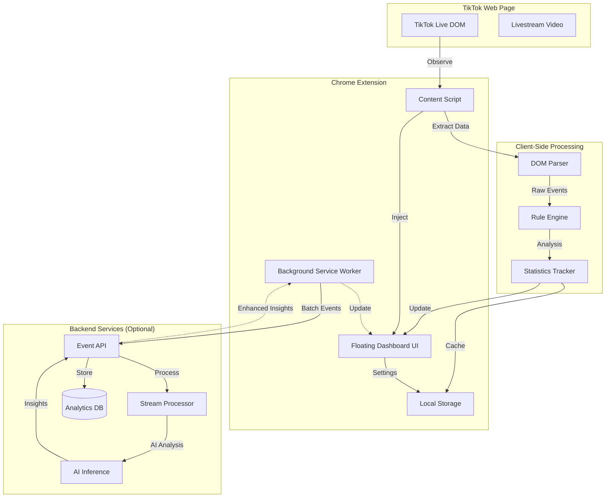
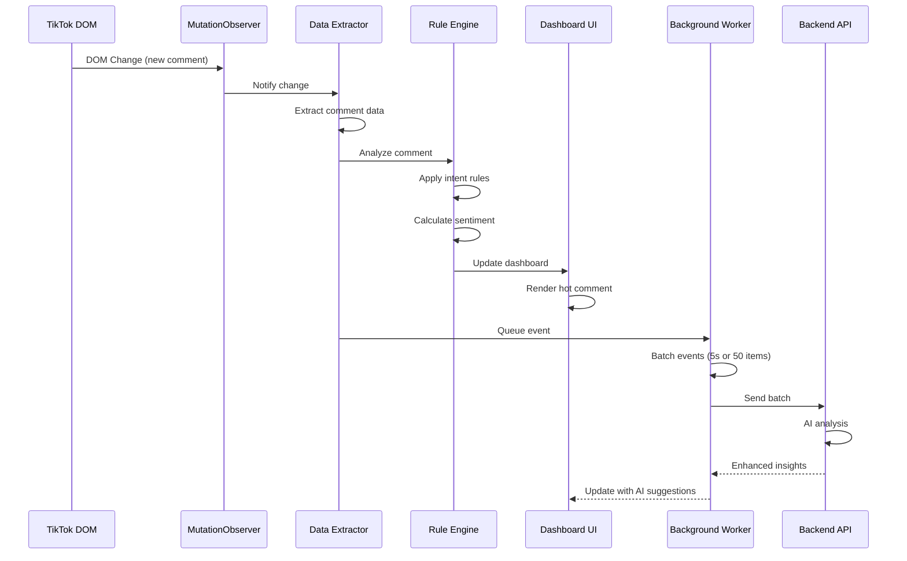
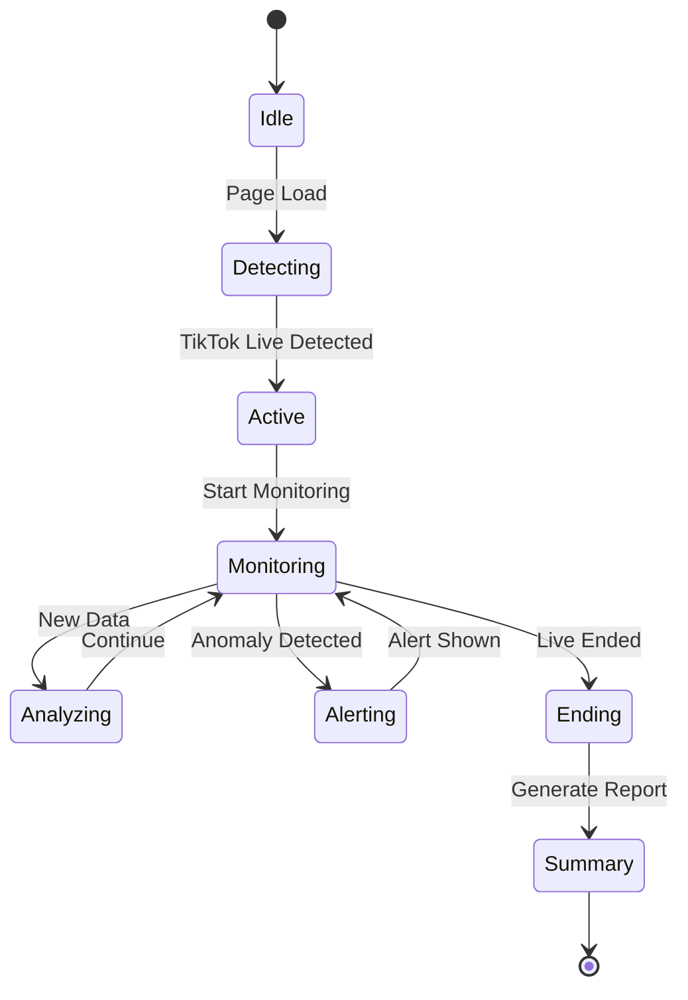

# TikTok Livestream Analytics Extension - Architecture Document

## 📋 Executive Summary

**Extension Name:** TikTok Live Insight  
**Target Platform:** Chrome Extension (Manifest V3)  
**Primary Users:** TikTok Livestream Hosts & Moderators  
**Core Value:** Real-time comment analysis, viewer engagement tracking, and actionable insights during live sessions

---

## 🎯 Project Objectives

### Primary Goals
1. **Real-time Analysis**: Monitor and analyze TikTok livestream data as it happens
2. **Non-intrusive UI**: Floating dashboard that doesn't block livestream content
3. **Actionable Insights**: Provide hosts with immediate, actionable recommendations
4. **Performance**: Minimal impact on browser and livestream performance
5. **Privacy-First**: Client-side processing with optional backend enhancement

### Success Metrics
- Extension loads within 500ms of page load
- UI overlay uses <5% CPU during active livestream
- Comment analysis latency <100ms for rule-based detection
- Zero CSP violations or TikTok ToS conflicts

---

## 🏗️ System Architecture

### High-Level Architecture



### Component Breakdown

#### 1. **Content Script** (`content.js`)
**Responsibilities:**
- DOM observation using MutationObserver
- Extract comment data (text, username, timestamp)
- Monitor viewer count, likes, shares
- Detect product pins and pricing
- Inject floating dashboard UI
- Client-side rule-based analysis

**Key Technologies:**
- MutationObserver API for real-time DOM changes
- CSS Selectors for data extraction
- LocalStorage for caching
- PostMessage for UI communication

#### 2. **Background Service Worker** (`background.js`)
**Responsibilities:**
- Event aggregation and batching
- Backend API communication
- WebSocket management (for real-time backend sync)
- Notification management
- Cross-tab state synchronization

**Key Technologies:**
- Service Worker API
- Fetch API for HTTP requests
- WebSocket for real-time communication
- Chrome Storage API
- Chrome Notifications API

#### 3. **Floating Dashboard UI** (`dashboard.html/js/css`)
**Responsibilities:**
- Display real-time metrics
- Show comment insights
- Render mini charts (viewer/comment trends)
- Display alerts and recommendations
- Module toggle controls

**Key Technologies:**
- Shadow DOM for style isolation
- Chart.js for mini visualizations
- CSS Grid/Flexbox for responsive layout
- Web Components for modularity

#### 4. **Popup Interface** (`popup.html/js`)
**Responsibilities:**
- Extension settings
- API key configuration
- Feature toggles
- Session history
- Export analytics

---

## 📊 Data Collection Strategy

### Client-Side Data Sources

#### 1. **Comment Stream**
```javascript
// Target DOM structure (example)
{
  selector: '[data-e2e="comment-item"]',
  fields: {
    username: '.username',
    text: '.comment-text',
    timestamp: '.timestamp',
    avatar: 'img.avatar'
  }
}
```

**Extracted Data:**
- Comment text (full content)
- Username
- User avatar URL
- Timestamp (relative or absolute)
- Comment ID (if available)

#### 2. **Engagement Metrics**
```javascript
{
  viewers: '[data-e2e="viewer-count"]',
  likes: '[data-e2e="like-count"]',
  shares: '[data-e2e="share-count"]',
  duration: '.live-duration'
}
```

#### 3. **Product Information**
```javascript
{
  productName: '.product-card .title',
  productPrice: '.product-card .price',
  productImage: '.product-card img',
  isPinned: '.product-card.pinned'
}
```

### Data Schema

```typescript
interface LivestreamEvent {
  type: 'comment' | 'viewer_update' | 'engagement' | 'product_pin';
  timestamp: number;
  sessionId: string;
  data: CommentData | ViewerData | EngagementData | ProductData;
}

interface CommentData {
  id: string;
  username: string;
  text: string;
  timestamp: number;
  intent?: 'question' | 'price_inquiry' | 'spam' | 'positive' | 'negative';
  sentiment?: number; // -1 to 1
  priority?: 'high' | 'medium' | 'low';
}

interface ViewerData {
  count: number;
  delta: number; // change from last measurement
  trend: 'rising' | 'stable' | 'falling';
}

interface EngagementData {
  likes: number;
  shares: number;
  comments: number;
  engagementRate: number;
}

interface ProductData {
  name: string;
  price: string;
  isPinned: boolean;
  mentionCount: number;
  conversionSignals: number;
}
```

---

## 🧠 Analysis & Processing

### Client-Side Rule Engine

#### 1. **Intent Detection (Rule-Based)**

```javascript
const intentRules = {
  priceInquiry: {
    keywords: ['giá', 'bao nhiêu', 'price', 'cost', '얼마', 'berapa'],
    patterns: [/\d+\s*(k|đ|vnd|usd)/i],
    priority: 'high'
  },
  
  spam: {
    keywords: ['follow me', 'check bio', 'dm me', 'link in bio'],
    repeatedChars: /(.)\1{4,}/,
    priority: 'low'
  },
  
  productInterest: {
    keywords: ['mua', 'order', 'đặt hàng', 'buy', 'want'],
    context: ['product_pinned'],
    priority: 'high'
  },
  
  question: {
    patterns: [/\?$/, /how to/i, /làm sao/i, /như thế nào/i],
    priority: 'medium'
  }
};
```

#### 2. **Sentiment Analysis (Lightweight)**

```javascript
const sentimentLexicon = {
  positive: ['tuyệt', 'đẹp', 'hay', 'good', 'great', 'love', '❤️', '👍'],
  negative: ['tệ', 'dở', 'bad', 'hate', 'scam', '👎'],
  weights: { positive: 1, negative: -1 }
};

function calculateSentiment(text) {
  // Simple bag-of-words approach
  let score = 0;
  const words = text.toLowerCase().split(/\s+/);
  
  words.forEach(word => {
    if (sentimentLexicon.positive.includes(word)) score += 1;
    if (sentimentLexicon.negative.includes(word)) score -= 1;
  });
  
  return Math.max(-1, Math.min(1, score / words.length));
}
```

#### 3. **Anomaly Detection**

```javascript
class AnomalyDetector {
  constructor() {
    this.baseline = {
      avgViewers: 0,
      avgCommentRate: 0,
      avgEngagementRate: 0
    };
    this.history = [];
    this.windowSize = 60; // 60 seconds
  }
  
  detectViewerDrop(currentViewers) {
    const recentAvg = this.getRecentAverage('viewers');
    const dropPercentage = ((recentAvg - currentViewers) / recentAvg) * 100;
    
    return {
      isAnomaly: dropPercentage > 20, // 20% drop
      severity: dropPercentage > 40 ? 'critical' : 'warning',
      message: `Viewer drop: ${dropPercentage.toFixed(1)}%`
    };
  }
  
  detectCommentSpike(commentRate) {
    const recentAvg = this.getRecentAverage('commentRate');
    const spikePercentage = ((commentRate - recentAvg) / recentAvg) * 100;
    
    return {
      isAnomaly: spikePercentage > 50,
      type: 'positive',
      message: `Comment activity +${spikePercentage.toFixed(1)}%`
    };
  }
}
```

### Backend AI Processing (Optional Enhancement)

#### 1. **Event Streaming Pipeline**

```javascript
// Background worker batches events
class EventBatcher {
  constructor() {
    this.buffer = [];
    this.batchSize = 50;
    this.flushInterval = 5000; // 5 seconds
  }
  
  async addEvent(event) {
    this.buffer.push(event);
    
    if (this.buffer.length >= this.batchSize) {
      await this.flush();
    }
  }
  
  async flush() {
    if (this.buffer.length === 0) return;
    
    const batch = this.buffer.splice(0);
    
    try {
      await fetch('https://api.yourbackend.com/events/batch', {
        method: 'POST',
        headers: { 'Content-Type': 'application/json' },
        body: JSON.stringify({
          sessionId: this.sessionId,
          events: batch,
          timestamp: Date.now()
        })
      });
    } catch (error) {
      console.error('Failed to send batch:', error);
      // Retry logic or local storage fallback
    }
  }
}
```

#### 2. **AI Inference API**

```javascript
// Backend endpoint structure
POST /api/analyze/comments
{
  "comments": [
    { "id": "c1", "text": "Sản phẩm này có màu xanh không?" },
    { "id": "c2", "text": "Giá bao nhiêu vậy shop?" }
  ],
  "context": {
    "productPinned": "Áo thun cotton",
    "currentPrice": "199k"
  }
}

// Response
{
  "results": [
    {
      "commentId": "c1",
      "intent": "product_inquiry",
      "sentiment": 0.2,
      "suggestedResponse": "Có 3 màu: xanh, đỏ, trắng ạ!",
      "priority": "high"
    },
    {
      "commentId": "c2",
      "intent": "price_inquiry",
      "sentiment": 0.0,
      "suggestedResponse": "Giá 199k đang sale 30% bạn nhé!",
      "priority": "high"
    }
  ]
}
```

#### 3. **LLM Integration Strategy**

**Minimize LLM Calls:**
- Use rule-based filtering first
- Only send high-priority/ambiguous comments to LLM
- Batch multiple comments in single request
- Cache common patterns/responses

**Prompt Template:**
```
You are a TikTok livestream assistant. Analyze these comments and provide:
1. Intent classification (price_inquiry, product_question, spam, general)
2. Sentiment score (-1 to 1)
3. Suggested host response (max 20 words, Vietnamese)
4. Priority (high/medium/low)

Context:
- Product: {productName}
- Price: {price}
- Current viewers: {viewerCount}

Comments:
{commentList}

Return JSON array with analysis for each comment.
```

---

## 🎨 UI/UX Design

### Floating Dashboard Layout

```
┌─────────────────────────────────────┐
│  TikTok Live Insight    [−] [×]     │
├─────────────────────────────────────┤
│  📊 Metrics          🔔 Alerts (2)  │
├─────────────────────────────────────┤
│  👥 Viewers: 1,234 (↑ 12%)          │
│  💬 Comments: 45/min                 │
│  ❤️ Engagement: 8.5%                 │
├─────────────────────────────────────┤
│  🔥 Hot Comments                     │
│  ┌─────────────────────────────┐    │
│  │ @user123: Giá bao nhiêu?    │    │
│  │ 💡 Suggest: "199k sale 30%!" │    │
│  └─────────────────────────────┘    │
│  ┌─────────────────────────────┐    │
│  │ @user456: Có ship HN không? │    │
│  │ 💡 Suggest: "Free ship HN!"  │    │
│  └─────────────────────────────┘    │
├─────────────────────────────────────┤
│  📈 Trend (Last 5 min)               │
│  [Mini Chart: Viewers & Comments]   │
├─────────────────────────────────────┤
│  ⚙️ [Comments] [Alerts] [Stats]     │
└─────────────────────────────────────┘
```

### Dashboard Features

#### 1. **Metrics Panel**
- Real-time viewer count with trend indicator
- Comments per minute
- Engagement rate (likes + comments / viewers)
- Session duration

#### 2. **Hot Comments Section**
- Shows high-priority comments (price inquiries, product questions)
- AI-suggested responses
- One-click copy suggestion
- Mark as answered/spam

#### 3. **Mini Charts**
- Line chart: Viewer count over time
- Bar chart: Comment volume by minute
- Sparkline: Engagement rate trend

#### 4. **Alert System**
- Popup notifications for critical events
- Visual highlights on dashboard
- Sound alerts (optional, toggle-able)

#### 5. **Module Toggles**
- Enable/disable comment analysis
- Enable/disable alerts
- Enable/disable charts
- Minimize/expand sections

### UI Implementation

```html
<!-- dashboard.html (injected into page) -->
<div id="tiktok-live-insight" class="tli-container">
  <div class="tli-header">
    <span class="tli-logo">📊 TikTok Live Insight</span>
    <div class="tli-controls">
      <button class="tli-minimize">−</button>
      <button class="tli-close">×</button>
    </div>
  </div>
  
  <div class="tli-tabs">
    <button class="tli-tab active" data-tab="metrics">Metrics</button>
    <button class="tli-tab" data-tab="comments">Comments</button>
    <button class="tli-tab" data-tab="alerts">Alerts</button>
  </div>
  
  <div class="tli-content">
    <div class="tli-panel" data-panel="metrics">
      <!-- Metrics content -->
    </div>
    <div class="tli-panel hidden" data-panel="comments">
      <!-- Hot comments -->
    </div>
    <div class="tli-panel hidden" data-panel="alerts">
      <!-- Alert history -->
    </div>
  </div>
</div>
```

```css
/* dashboard.css */
.tli-container {
  position: fixed;
  top: 80px;
  right: 20px;
  width: 360px;
  max-height: 600px;
  background: rgba(0, 0, 0, 0.9);
  backdrop-filter: blur(10px);
  border-radius: 12px;
  border: 1px solid rgba(255, 255, 255, 0.1);
  box-shadow: 0 8px 32px rgba(0, 0, 0, 0.4);
  color: white;
  font-family: -apple-system, BlinkMacSystemFont, 'Segoe UI', sans-serif;
  z-index: 999999;
  overflow: hidden;
  transition: all 0.3s ease;
}

.tli-container.minimized {
  height: 48px;
  overflow: hidden;
}

.tli-header {
  display: flex;
  justify-content: space-between;
  align-items: center;
  padding: 12px 16px;
  background: linear-gradient(135deg, #667eea 0%, #764ba2 100%);
  cursor: move; /* Draggable */
}

.tli-metric {
  display: flex;
  justify-content: space-between;
  padding: 8px 16px;
  border-bottom: 1px solid rgba(255, 255, 255, 0.05);
}

.tli-metric-value {
  color: white;
  font-size: 18px;
  font-weight: 600;
}

.tli-trend-up {
  color: #10b981;
}

.tli-trend-down {
  color: #ef4444;
}

.tli-comment-card {
  background: rgba(255, 255, 255, 0.05);
  border-radius: 8px;
  padding: 12px;
  margin: 8px 16px;
  border-left: 3px solid #667eea;
}

.tli-suggestion {
  background: rgba(102, 126, 234, 0.2);
  padding: 8px;
  border-radius: 4px;
  margin-top: 8px;
  font-size: 13px;
  display: flex;
  justify-content: space-between;
  align-items: center;
}

.tli-copy-btn {
  background: #667eea;
  border: none;
  padding: 4px 8px;
  border-radius: 4px;
  color: white;
  cursor: pointer;
  font-size: 11px;
}
```

---

## 🚨 Alert System

### Alert Types

#### 1. **Viewer Alerts**
```javascript
{
  type: 'viewer_drop',
  severity: 'warning',
  message: 'Viewer count dropped 25% in last 2 minutes',
  suggestion: 'Consider changing topic or showing product',
  timestamp: Date.now()
}
```

#### 2. **Engagement Alerts**
```javascript
{
  type: 'comment_spike',
  severity: 'info',
  message: 'Comment activity increased 60%',
  suggestion: 'Audience is engaged! Good time to pitch product',
  timestamp: Date.now()
}
```

#### 3. **Product Alerts**
```javascript
{
  type: 'product_interest',
  severity: 'high',
  message: '5 price inquiries in last minute',
  suggestion: 'Repeat price and promotion clearly',
  relatedComments: ['c1', 'c2', 'c3', 'c4', 'c5']
}
```

#### 4. **Spam Alerts**
```javascript
{
  type: 'spam_detected',
  severity: 'low',
  message: '3 spam comments detected',
  suggestion: 'Consider enabling comment filters',
  spamUsers: ['user1', 'user2', 'user3']
}
```

### Alert Delivery

```javascript
class AlertManager {
  constructor() {
    this.alerts = [];
    this.maxAlerts = 10;
    this.soundEnabled = true;
  }
  
  trigger(alert) {
    // Add to queue
    this.alerts.unshift(alert);
    if (this.alerts.length > this.maxAlerts) {
      this.alerts.pop();
    }
    
    // Visual notification
    this.showPopup(alert);
    
    // Sound notification
    if (this.soundEnabled && alert.severity !== 'low') {
      this.playSound(alert.severity);
    }
    
    // Browser notification (if permitted)
    if (alert.severity === 'critical') {
      this.sendBrowserNotification(alert);
    }
    
    // Update badge
    this.updateBadge();
  }
  
  showPopup(alert) {
    const popup = document.createElement('div');
    popup.className = `tli-alert tli-alert-${alert.severity}`;
    popup.innerHTML = `
      <div class="tli-alert-icon">${this.getIcon(alert.type)}</div>
      <div class="tli-alert-content">
        <div class="tli-alert-message">${alert.message}</div>
        <div class="tli-alert-suggestion">💡 ${alert.suggestion}</div>
      </div>
      <button class="tli-alert-close">×</button>
    `;
    
    document.getElementById('tli-alert-container').appendChild(popup);
    
    // Auto-dismiss after 5 seconds
    setTimeout(() => popup.remove(), 5000);
  }
}
```

---

## 📁 File Structure

```
TikTokLive-Analytics-Extension/
├── manifest.json                 # Extension manifest (Manifest V3)
├── README.md                      # Documentation
├── ARCHITECTURE.md                # This file
│
├── icons/                         # Extension icons
│   ├── icon-16.png
│   ├── icon-48.png
│   ├── icon-128.png
│   └── icon-512.png
│
├── src/
│   ├── content/                   # Content scripts
│   │   ├── content.js             # Main content script
│   │   ├── dom-observer.js        # DOM monitoring
│   │   ├── data-extractor.js      # Data extraction logic
│   │   └── content.css            # Injected styles
│   │
│   ├── background/                # Background service worker
│   │   ├── background.js          # Main service worker
│   │   ├── event-batcher.js       # Event batching
│   │   ├── api-client.js          # Backend API client
│   │   └── websocket-manager.js   # WebSocket handling
│   │
│   ├── dashboard/                 # Floating dashboard
│   │   ├── dashboard.html         # Dashboard template
│   │   ├── dashboard.js           # Dashboard logic
│   │   ├── dashboard.css          # Dashboard styles
│   │   ├── components/
│   │   │   ├── metrics-panel.js
│   │   │   ├── comments-panel.js
│   │   │   ├── alerts-panel.js
│   │   │   └── chart-renderer.js
│   │   └── utils/
│   │       ├── chart-utils.js
│   │       └── dom-utils.js
│   │
│   ├── popup/                     # Extension popup
│   │   ├── popup.html
│   │   ├── popup.js
│   │   └── popup.css
│   │
│   ├── analysis/                  # Analysis engines
│   │   ├── rule-engine.js         # Rule-based intent detection
│   │   ├── sentiment-analyzer.js  # Lightweight sentiment analysis
│   │   ├── anomaly-detector.js    # Anomaly detection
│   │   └── pattern-matcher.js     # Pattern matching utilities
│   │
│   ├── utils/                     # Shared utilities
│   │   ├── storage.js             # Chrome storage wrapper
│   │   ├── logger.js              # Logging utility
│   │   ├── constants.js           # Constants and config
│   │   └── helpers.js             # Helper functions
│   │
│   └── libs/                      # Third-party libraries
│       ├── chart.min.js           # Chart.js (lightweight)
│       └── date-fns.min.js        # Date utilities
│
├── config/
│   ├── selectors.json             # TikTok DOM selectors
│   ├── intent-rules.json          # Intent detection rules
│   └── sentiment-lexicon.json     # Sentiment keywords
│
└── tests/
    ├── unit/
    ├── integration/
    └── e2e/
```

---

## 🔄 Data Flow

### Real-time Processing Flow



### Session Lifecycle



---

## 🎯 MVP Features

### Phase 1: Core Functionality (MVP)

#### ✅ Must Have
1. **Extension Installation & Setup**
   - Chrome Web Store listing
   - One-click installation
   - Basic settings (enable/disable features)

2. **TikTok Live Detection**
   - Auto-detect when user is on TikTok Live page
   - Show/hide dashboard based on live status

3. **Comment Monitoring**
   - Real-time comment extraction
   - Display last 10 comments
   - Basic intent detection (price inquiry, questions)

4. **Basic Metrics**
   - Current viewer count
   - Comment count
   - Session duration

5. **Floating Dashboard**
   - Draggable, resizable panel
   - Minimize/maximize
   - Basic styling (dark theme)

6. **Rule-Based Alerts**
   - Price inquiry detection
   - Viewer drop alert (>20%)
   - Comment spike alert

7. **Post-Live Summary**
   - Total viewers (peak/average)
   - Total comments
   - Top keywords
   - Export as JSON

#### 🎨 Nice to Have (Phase 1.5)
- Mini charts (viewer trend)
- Sentiment indicators (emoji)
- Keyboard shortcuts
- Custom alert thresholds

### Phase 2: AI Enhancement

#### 🤖 AI Features
1. **Backend Integration**
   - Event streaming API
   - WebSocket for real-time updates
   - User authentication

2. **LLM-Powered Analysis**
   - Advanced intent classification
   - Context-aware sentiment analysis
   - Suggested responses for hosts
   - Product mention tracking

3. **Predictive Insights**
   - Viewer retention prediction
   - Optimal product pitch timing
   - Engagement optimization tips

4. **Multi-Language Support**
   - Vietnamese, English, Thai, Indonesian
   - Auto-detect comment language

### Phase 3: SaaS Platform

#### 🚀 Platform Features
1. **Multi-Session Analytics**
   - Historical data across sessions
   - Performance comparison
   - Trend analysis over time

2. **Team Collaboration**
   - Multi-user support (host + mods)
   - Role-based access
   - Shared insights

3. **Advanced Reporting**
   - PDF/Excel export
   - Custom dashboards
   - Scheduled reports

4. **Integrations**
   - CRM integration
   - E-commerce platform sync
   - Social media cross-posting

5. **Premium Features**
   - Unlimited AI analysis
   - Priority support
   - Custom branding
   - API access

---

## 🛡️ Security & Privacy

### Data Handling

#### Client-Side Only (Default)
- All analysis happens in browser
- No data sent to external servers
- Local storage for session cache
- User controls all data

#### Optional Backend (Opt-in)
- User must explicitly enable
- API key required
- Data encrypted in transit (HTTPS)
- Data retention policy (30 days)
- GDPR compliant
- User can request data deletion

### Permissions

```json
{
  "permissions": [
    "activeTab",           // Access current tab
    "storage",             // Local storage
    "notifications"        // Browser notifications
  ],
  "host_permissions": [
    "https://*.tiktok.com/*"  // Only TikTok domains
  ]
}
```

### CSP Compliance
- No inline scripts (use external files)
- No eval() or Function()
- Use nonce for injected scripts if needed
- Respect TikTok's CSP headers

---

## 🚀 Deployment Strategy

### Development
1. Local testing with `chrome://extensions/` (Developer mode)
2. Test on various TikTok live streams
3. Performance profiling (CPU, memory)
4. Cross-browser testing (Chrome, Edge)

### Beta Release
1. Limited beta testers (10-20 users)
2. Feedback collection
3. Bug fixes and optimization
4. A/B testing for UI variations

### Production Release
1. Chrome Web Store submission
2. Marketing materials (screenshots, demo video)
3. Landing page with documentation
4. Support channels (Discord, email)

### Update Strategy
- Auto-update via Chrome Web Store
- Changelog in extension popup
- Breaking changes communicated via notification
- Rollback plan for critical bugs

---

## 📈 Expansion Roadmap

### Short-term (3-6 months)
- [ ] Multi-platform support (Facebook Live, YouTube Live)
- [ ] Mobile app (React Native) for hosts
- [ ] Browser extension for Firefox, Safari
- [ ] Advanced AI models (fine-tuned for e-commerce)

### Mid-term (6-12 months)
- [ ] SaaS dashboard (web app)
- [ ] Team collaboration features
- [ ] API for third-party integrations
- [ ] White-label solution for agencies

### Long-term (12+ months)
- [ ] AI-powered auto-moderation
- [ ] Real-time translation for global audiences
- [ ] Influencer marketplace integration
- [ ] Predictive analytics for sales forecasting

---

## 🔧 Technical Considerations

### Performance Optimization
1. **Debouncing & Throttling**
   - Limit DOM observations to 100ms intervals
   - Batch UI updates using requestAnimationFrame

2. **Memory Management**
   - Limit comment history to last 100 items
   - Clear old data on session end
   - Use WeakMap for DOM references

3. **Lazy Loading**
   - Load charts only when tab is active
   - Defer non-critical analysis

### Error Handling
1. **Graceful Degradation**
   - If backend is down, fall back to client-side only
   - If DOM selectors fail, show generic message

2. **Retry Logic**
   - Exponential backoff for API calls
   - Max 3 retries before giving up

3. **Logging**
   - Console logs for development
   - Sentry integration for production errors
   - User-friendly error messages

### Browser Compatibility
- Chrome 88+ (Manifest V3 support)
- Edge 88+
- Opera 74+
- Brave (Chromium-based)

---

## 📚 References & Resources

### TikTok Web Structure
- TikTok uses React with dynamic class names
- Use `data-e2e` attributes for stable selectors
- WebSocket for real-time comment stream (inspect Network tab)

### Chrome Extension APIs
- [Manifest V3 Documentation](https://developer.chrome.com/docs/extensions/mv3/)
- [Content Scripts](https://developer.chrome.com/docs/extensions/mv3/content_scripts/)
- [Service Workers](https://developer.chrome.com/docs/extensions/mv3/service_workers/)

### AI/ML Resources
- [Gemini API](https://ai.google.dev/docs) for LLM integration
- [TensorFlow.js](https://www.tensorflow.org/js) for client-side ML
- [Sentiment Analysis Models](https://huggingface.co/models?pipeline_tag=sentiment-analysis)

---

## 🎓 Best Practices

### Code Quality
- ESLint + Prettier for consistent formatting
- TypeScript for type safety
- Unit tests for critical functions (Jest)
- E2E tests for user flows (Playwright)

### Documentation
- JSDoc comments for all functions
- README with setup instructions
- CONTRIBUTING.md for open-source contributors
- CHANGELOG.md for version history

### Version Control
- Git with semantic versioning (semver)
- Feature branches + pull requests
- CI/CD with GitHub Actions
- Automated testing on PR

---

## 📞 Support & Maintenance

### User Support
- In-extension help button
- FAQ page
- Video tutorials
- Email support (response within 24h)

### Monitoring
- Error tracking (Sentry)
- Usage analytics (privacy-respecting)
- Performance monitoring (Web Vitals)
- User feedback collection

### Maintenance Plan
- Weekly bug fixes
- Monthly feature updates
- Quarterly major releases
- Annual security audits

---

**Document Version:** 1.0  
**Last Updated:** 2025-12-28  
**Author:** Senior Chrome Extension Engineer + AI Product Architect
